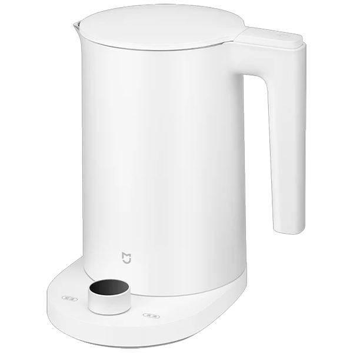
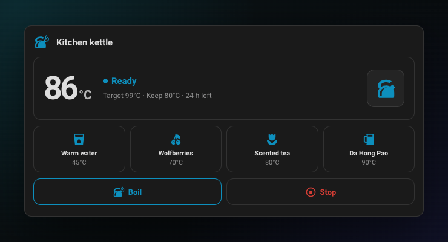
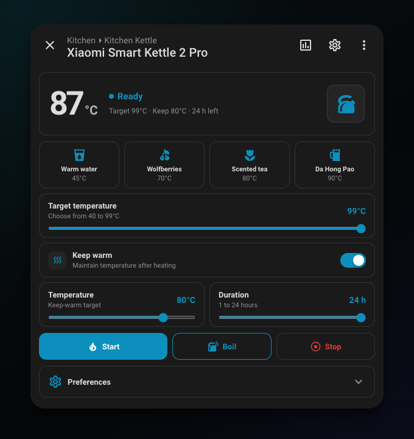

# Xiaomi Kettle for Home Assistant

English | [Русский](README.ru.md)

<p align="center">
  
</p>

[](https://github.com/qweritos/hass-xiaomi-kettle/releases)
[](https://github.com/qweritos/hass-xiaomi-kettle/actions/workflows/validate.yml)
[](https://github.com/qweritos/hass-xiaomi-kettle/actions/workflows/build.yml)

A human-friendly Home Assistant integration, compact dashboard card, native more-info UI, and kettle-cycle notifications for Xiaomi Smart Kettle 2 Pro (`yunmi.kettle.v19`) devices connected through [Xiaomi Miot](https://github.com/al-one/hass-xiaomi-miot).

The integration keeps Xiaomi Miot as the device connection. It adds a clean helper device, friendly entities, and the bundled UI without opening a second MiIO connection.

## Screenshots

### Dashboard control card



### Native device dialog



Both screenshots use live state from a real `yunmi.kettle.v19` kettle.

## Features

- Adds a human-friendly kettle device with status, temperature, keep-warm, program, Start, Boil, and Stop controls.
- Includes a compact configurable dashboard card and a redesigned native more-info dialog for supported kettle entities.
- Loads program names, temperatures, and keep-warm settings from the kettle's Xiaomi presets.
- Sends selectable Home Assistant sidebar notifications for heating, boiling, completion, kettle lift, and faults.
- Requires a second press within one second before heating or running a program.

## Requirements

- Home Assistant 2024.7.0 or newer.
- [Xiaomi Miot](https://github.com/al-one/hass-xiaomi-miot) configured with a `yunmi.kettle.v19` device.
- The kettle's Xiaomi Miot water-heater entity enabled.

## Installation

### HACS

[](https://my.home-assistant.io/redirect/hacs_repository/?owner=qweritos&repository=hass-xiaomi-kettle&category=integration)

If the button does not open HACS:

1. Open HACS and select **Custom repositories** from the menu.
2. Add `https://github.com/qweritos/hass-xiaomi-kettle` as an **Integration** repository.
3. Install **Xiaomi Kettle** and restart Home Assistant once.

Then open **Settings → Devices & services → Add integration → Xiaomi Kettle**, select the Xiaomi Miot kettle, and choose which kettle events should appear in Home Assistant's sidebar notifications.

The card and dialog are bundled and loaded automatically. The integration keeps its own versioned dashboard resource and `/local/xiaomi-kettle/` bundle current so cards recover even when Lovelace opens before Xiaomi Miot during Home Assistant startup; do not add a JavaScript resource manually.

### Manual

1. Download `xiaomi_kettle.zip` from the latest release.
2. Extract `custom_components/xiaomi_kettle` into the same path below your Home Assistant configuration directory.
3. Restart Home Assistant and add **Xiaomi Kettle** from **Settings → Devices & services**.

## Friendly device and notifications

The helper device includes:

- Kettle water heater and status sensor
- Dynamic Program select
- Start, Boil, and Stop buttons
- Keep-warm switch, temperature, and duration
- Xiaomi reminder, lift-memory, custom-knob, and do-not-disturb settings
- Kettle cycle event entity

Notification transition types can be changed from the integration's **Configure** button. Notifications appear only in Home Assistant's sidebar and are edge-triggered, so a boiling or finished message is created once per state transition rather than on every poll. Kettle state is refreshed automatically every second and the interval is intentionally not configurable.

## Dashboard card

Add **Xiaomi Kettle Card** from Home Assistant's dashboard card picker. Its visual editor configures the kettle entity, title, icon, Programs section, and Boil/Stop controls.

The same options are available in YAML. Use the friendly water-heater entity created by this integration:

```yaml
type: custom:xiaomi-kettle-card
entity: water_heater.kitchen_kettle_kettle
```

Optional configuration:

```yaml
type: custom:xiaomi-kettle-card
entity: water_heater.kitchen_kettle_kettle
name: Kitchen kettle
icon: mdi:kettle-steam
preset_icons:
  Warm water: mdi:cup-water
  Wolfberries: mdi:fruit-cherries
show_controls: true
show_presets: true
```

`name` and `icon` customize the card header. The visual editor lists Xiaomi Home presets with a native icon picker for each one; the equivalent `preset_icons` YAML maps exact preset names to Material Design icons. Card mappings override kettle-wide icons selected from the integration's **Configure** flow. Set `show_presets: false` to hide programs and `show_controls: false` to hide the Boil and Stop row. The status block is always visible. Tap its large temperature to open Home Assistant's native current/target temperature history graph. Press the card header or any entity belonging to the source/helper kettle to open the custom native dialog.

## Presets

The integration parses Xiaomi's `function.extended_mode` records:

```text
name,target,keep_enabled,keep_temperature,duration_minutes
```

Records are separated with `_`. Their order maps to MIoT target modes `10` through `15`. Presets edited in Xiaomi Home appear after Xiaomi Miot refreshes the entity.

## Development

Requires Node.js 24, Python 3.14, and Ruff.

```bash
npm install
npm run check
```

`npm run build` creates the bundled frontend at `custom_components/xiaomi_kettle/frontend/xiaomi-kettle-card.js`. Releases package the complete `custom_components/xiaomi_kettle` directory as `xiaomi_kettle.zip`.

## Product specifications

Living product requirements are organized by capability under [`openspec/specs`](openspec/specs). The project uses the project-local [minimalist OpenSpec schema](openspec/schemas/minimalist), with user stories and Given/When/Then acceptance criteria.

```bash
npm run spec:validate
```

The full `npm run check` workflow includes strict schema and specification validation.

## Compatibility note

Home Assistant does not expose public APIs for replacing an entity's more-info body or assigning an icon to a persistent notification. These narrowly scoped frontend changes are isolated in `src/more-info-interceptor.ts` and `src/notification-icon-interceptor.ts`, guard against duplicate patching, and leave unsupported devices and notifications untouched. A future Home Assistant frontend change may require an update.

## License

[MIT](LICENSE)
