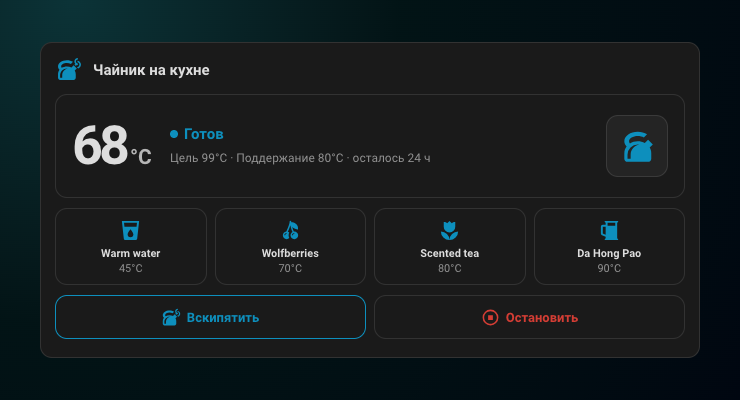
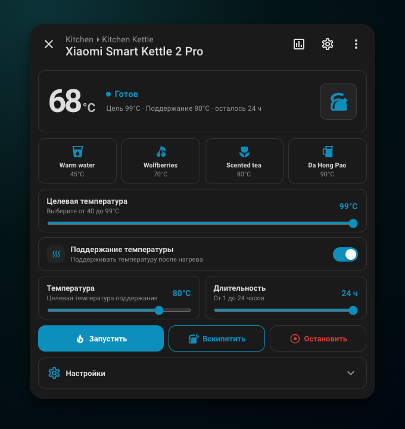

# Xiaomi Kettle для Home Assistant

[English](README.md) | Русский

<p align="center">
  
</p>

[](https://github.com/qweritos/hass-xiaomi-kettle/releases)
[](https://github.com/qweritos/hass-xiaomi-kettle/actions/workflows/validate.yml)
[](https://github.com/qweritos/hass-xiaomi-kettle/actions/workflows/build.yml)

Удобная интеграция для Home Assistant с компактной карточкой панели управления, собственным нативным интерфейсом подробной информации и уведомлениями о циклах работы Xiaomi Smart Kettle 2 Pro (`yunmi.kettle.v19`), подключённого через [Xiaomi Miot](https://github.com/al-one/hass-xiaomi-miot).

Для связи с устройством интеграция использует Xiaomi Miot. Она добавляет отдельное понятное устройство, удобные сущности и встроенный интерфейс, не открывая второе соединение MiIO.

## Скриншоты

### Карточка управления



### Нативный диалог устройства



На обоих скриншотах показано актуальное состояние настоящего чайника `yunmi.kettle.v19`.

## Возможности

- Добавляет удобное устройство чайника со статусом, температурой, поддержанием температуры, программами и кнопками запуска, кипячения и остановки.
- Содержит компактную настраиваемую карточку панели управления и обновлённый нативный диалог подробной информации для поддерживаемых сущностей чайника.
- Загружает названия программ, температуру и параметры поддержания температуры из предустановок чайника Xiaomi.
- Отправляет выбираемые уведомления на боковой панели Home Assistant о нагреве, кипячении, завершении работы, снятии чайника с подставки и ошибках.
- Перед началом нагрева или запуском программы требует повторного нажатия в течение одной секунды.

## Требования

- Home Assistant 2024.7.0 или новее.
- Настроенная интеграция [Xiaomi Miot](https://github.com/al-one/hass-xiaomi-miot) с устройством `yunmi.kettle.v19`.
- Включённая сущность водонагревателя чайника в Xiaomi Miot.

## Установка

### HACS

[](https://my.home-assistant.io/redirect/hacs_repository/?owner=qweritos&repository=hass-xiaomi-kettle&category=integration)

Если кнопка не открывает HACS:

1. Откройте HACS и выберите в меню **Пользовательские репозитории**.
2. Добавьте `https://github.com/qweritos/hass-xiaomi-kettle` как репозиторий типа **Интеграция**.
3. Установите **Xiaomi Kettle** и один раз перезапустите Home Assistant.

Затем откройте **Настройки → Устройства и службы → Добавить интеграцию → Xiaomi Kettle**, выберите чайник Xiaomi Miot и укажите, о каких событиях чайника нужно сообщать на боковой панели Home Assistant.

Карточка и диалог входят в комплект и загружаются автоматически. Интеграция поддерживает в актуальном состоянии собственный версионированный ресурс панели управления и пакет `/local/xiaomi-kettle/`, поэтому карточки восстанавливаются, даже если Lovelace открывается раньше Xiaomi Miot во время запуска Home Assistant. Не добавляйте JavaScript-ресурс вручную.

### Вручную

1. Скачайте `xiaomi_kettle.zip` из последнего релиза.
2. Распакуйте `custom_components/xiaomi_kettle` в такой же каталог внутри папки конфигурации Home Assistant.
3. Перезапустите Home Assistant и добавьте **Xiaomi Kettle** в разделе **Настройки → Устройства и службы**.

## Удобное устройство и уведомления

Вспомогательное устройство содержит:

- Водонагреватель чайника и датчик состояния
- Динамический выбор программы
- Кнопки запуска, кипячения и остановки
- Переключатель, температуру и длительность поддержания температуры
- Настройки напоминаний Xiaomi, памяти снятия с подставки, пользовательской температуры регулятора и режима «Не беспокоить»
- Сущность событий цикла работы чайника

Типы переходов для уведомлений можно изменить кнопкой **Настроить** у интеграции. Уведомления появляются только на боковой панели Home Assistant и создаются при изменении состояния: сообщение о кипячении или завершении появляется один раз при каждом переходе. Состояние чайника обновляется автоматически при публикации изменений Xiaomi Miot.

## Карточка панели управления

Добавьте **Xiaomi Kettle Card** через меню выбора карточки панели управления Home Assistant. В визуальном редакторе можно настроить сущность чайника, заголовок, значок, раздел программ и элементы управления кипячением и остановкой.

Те же параметры доступны в YAML. Используйте понятную сущность водонагревателя, созданную этой интеграцией:

```yaml
type: custom:xiaomi-kettle-card
entity: water_heater.kitchen_kettle_kettle
```

Дополнительные настройки:

```yaml
type: custom:xiaomi-kettle-card
entity: water_heater.kitchen_kettle_kettle
name: Чайник на кухне
icon: mdi:kettle-steam
preset_icons:
  Тёплая вода: mdi:cup-water
  Ягоды годжи: mdi:fruit-cherries
show_controls: true
show_presets: true
```

Параметры `name` и `icon` изменяют заголовок карточки. Визуальный редактор показывает предустановки Xiaomi Home и нативное поле выбора значка для каждой из них. Соответствующий параметр YAML `preset_icons` сопоставляет точные названия предустановок со значками Material Design. Настройки карточки имеют приоритет над общими значками чайника, выбранными через кнопку **Настроить** у интеграции. Укажите `show_presets: false`, чтобы скрыть программы, и `show_controls: false`, чтобы скрыть строку кнопок кипячения и остановки. Блок состояния отображается всегда. Нажмите на крупное значение температуры, чтобы открыть нативный график истории текущей и целевой температуры Home Assistant. Нажмите на заголовок карточки или любую сущность исходного или вспомогательного чайника, чтобы открыть собственный нативный диалог.

## Предустановки

Интеграция обрабатывает записи Xiaomi `function.extended_mode`:

```text
name,target,keep_enabled,keep_temperature,duration_minutes
```

Записи разделяются символом `_`. Их порядок соответствует целевым режимам MIoT с `10` по `15`. Изменённые в Xiaomi Home предустановки появятся после обновления сущности Xiaomi Miot.

## Разработка

Требуются Node.js 24, Python 3.14 и Ruff.

```bash
npm install
npm run check
```

Команда `npm run build` создаёт пакет фронтенда `custom_components/xiaomi_kettle/frontend/xiaomi-kettle-card.js`. В релиз входит весь каталог `custom_components/xiaomi_kettle`, упакованный как `xiaomi_kettle.zip`.

## Спецификации продукта

Актуальные требования к продукту сгруппированы по возможностям в каталоге [`openspec/specs`](openspec/specs). Проект использует локальную [минималистичную схему OpenSpec](openspec/schemas/minimalist) с пользовательскими историями и критериями приёмки в формате «Дано/Когда/Тогда».

```bash
npm run spec:validate
```

Полная проверка `npm run check` включает строгую валидацию схемы и спецификаций.

## Примечание о совместимости

Home Assistant не предоставляет публичных API для замены содержимого окна подробной информации о сущности или назначения значка постоянному уведомлению. Эти точечные изменения фронтенда изолированы в `src/more-info-interceptor.ts` и `src/notification-icon-interceptor.ts`, защищены от повторного применения и не затрагивают неподдерживаемые устройства и уведомления. Будущие изменения фронтенда Home Assistant могут потребовать обновления.

## Лицензия

[MIT](LICENSE)
